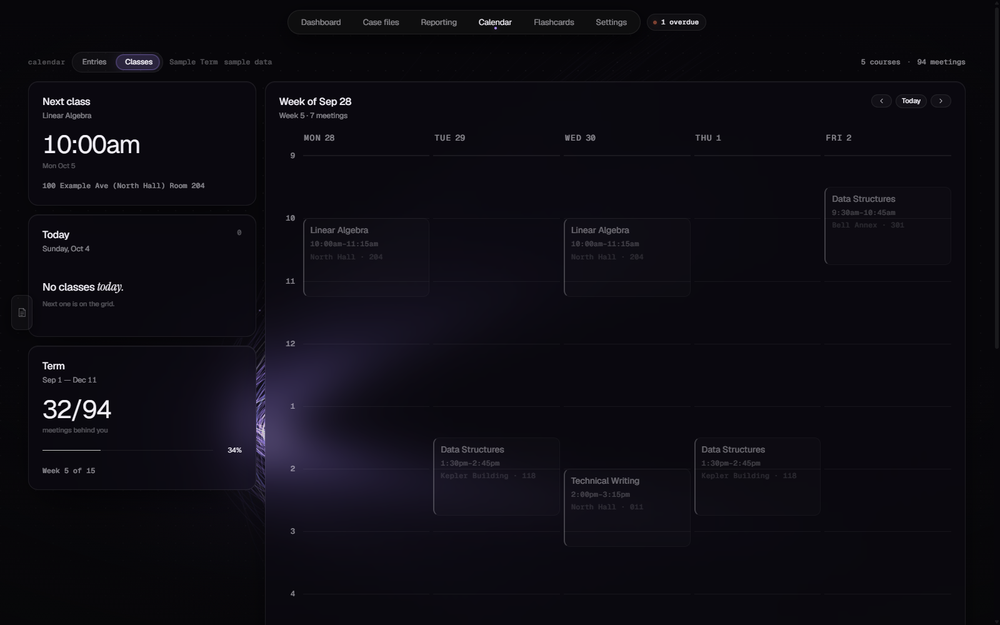
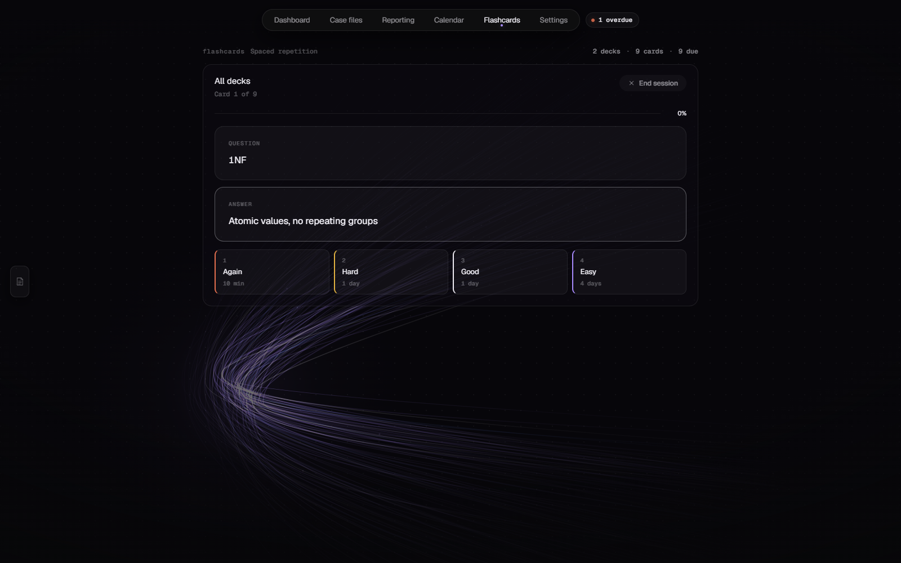
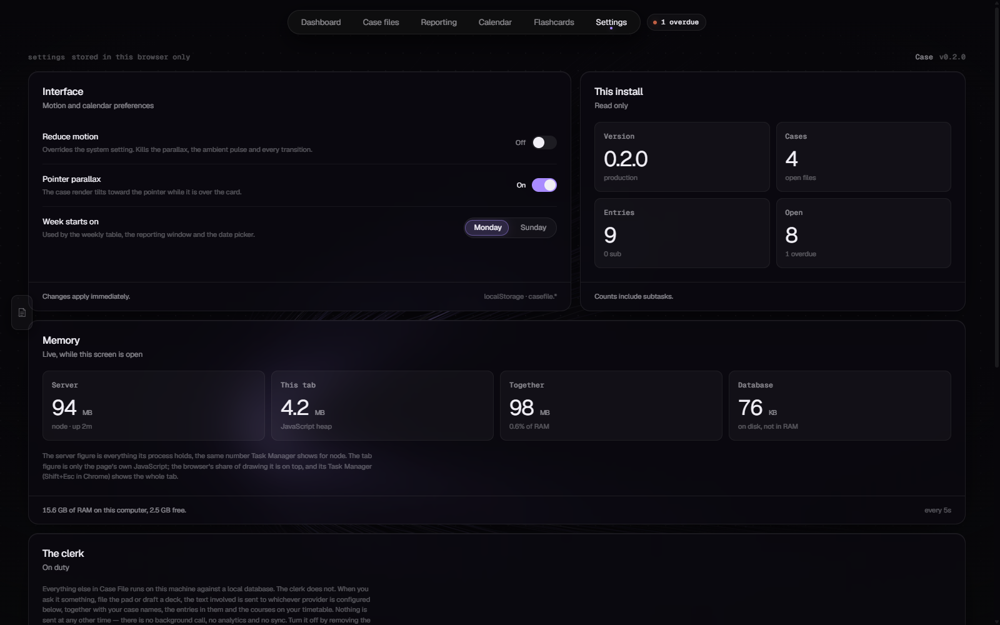
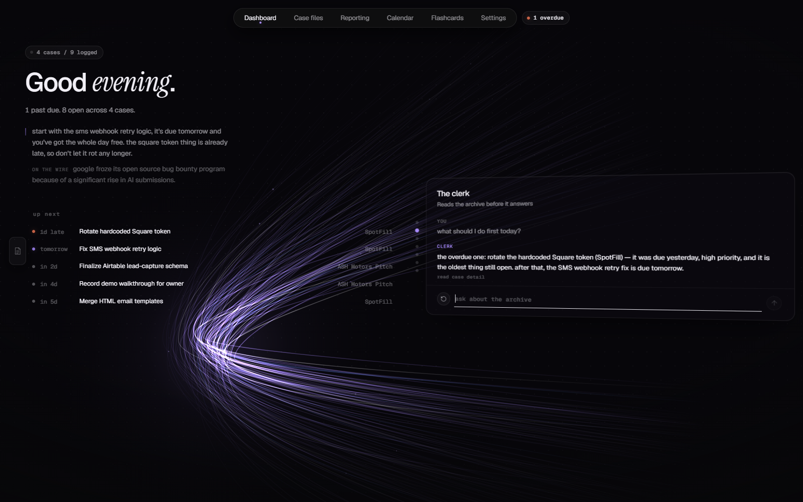

# Case

A local-first case tracker. Work is grouped into **cases**, each holding **entries** with
due dates, priorities and nested subtasks; the app reads that back to you as a dashboard
rather than a to-do list — completion rates, what is overdue, what is stalled, and a
weekly class timetable read straight from a registrar `.ics` export.

Everything runs on your own machine against a local SQLite file. There is no account, no
sync and no telemetry.

One part is opt-in and does leave the machine: **the clerk**, an agent that files your
notes into the archive, writes the day's brief, answers questions about what you have
logged and makes the changes you ask it for — each one waiting for your click before it
is written. It does nothing until you put an API key in `.env` yourself — see
[The clerk](#the-clerk).


---

## Screens

| | |
|---|---|
| **Dashboard** | A greeting and what is coming on the left; one card at a time on the right, paged with the wheel. The case structure comes first — click the drawing to move it on to the next case — then the clerk's chat, workload, recommendations, tracking, the weekly report and the completion rate. |
| **Case files** | The working screen. Create, rename, reorder and delete cases; add sub-cases; log entries with dates and priorities; nest subtasks under an entry. The entries take the left of the screen; the case structure stands on the right as a turned panel, with the seven readings of the case paged one at a time underneath it at the same angle. Only the one with the drawing on it turns further under the pointer. |
| **Reporting** | Every open entry bucketed by due day — Overdue / This week / Later — plus a world-news feed from public RSS. |
| **Calendar** | Two calendars over the same days. **Entries** is a month grid of every dated entry in the archive, coloured by how its deadline stands, and clicking one opens its case. **Classes** is a weekly timetable parsed from `src/data/class-calendar.ics`, with next class, today's agenda and term progress. |
| **Flashcards** | Import a deck from a `.json` file or pasted text — or paste a lecture and have the clerk draft one — file it under a course, and review it on an SM-2 spaced schedule. The scheduling is offline SM-2 and always has been; only drafting a new deck calls a model, and only when you ask it to. |
| **Settings** | The accent colour; motion preferences, including a reduced-motion override; what this install holds; a live reading of how much memory the app is using; and what the clerk sends where. |

*Every screenshot here is of the sample archive a fresh install seeds, not anyone's real
cases.*

A scratchpad sits behind a tab on the left edge of every screen: a page slides out with
nothing on it but somewhere to type. It saves as you go and follows you between screens.
With a key configured it is also where filing happens: **File it** hands the pad to the
clerk, which proposes entries you review before anything is written.


Entries come first on the Case files screen, with the diagram behind them — the two dots
at the corner switch between them. **Dragging one entry onto another files it as a
subtask**, and dragging it onto an entry in a different case moves it there. Subtasks stay
one level deep, so an entry that already holds subtasks cannot itself become one.

### The case-structure diagram


The centrepiece of the Dashboard and Case files screens: a case drawn as a **flow**. The
case is the first step, its entries are the steps that come off it, and a subtask is a step
off an entry. Each one is a card with a name and a line of data under it, and the lines
between them are curves leaving one card's right edge and arriving at the next one's left.

It replaced a force-directed graph, and the difference is the point. A simulation decides
where things go and you read the result; a flow is laid out — left to right, each parent
level with the middle of its own children — so the same case comes out the same shape every
time, the lines never cross, and the drawing says what belongs to what rather than what
happens to be near what.

Colour means state and nothing else: **white** open, **amber** due soon, **red** overdue,
**violet** closed. Hovering a step lifts it, brings its own wires up with it and steps the
rest back, so one branch can be followed through a busy case without reading every card on
the way.

On the dashboard the drawing is something you flip through: **click anywhere on it** and
the board moves on to the next case, wrapping after the last. The new case comes in from
the left a column at a time — the case, then its entries, then their subtasks — the way
the flow reads. The tools down the panel's left edge, and the Case files screen, where the
drawing is the case you are working on, do not cycle.

It is built as HTML cards over a single SVG of wires rather than as one drawing. Text in
SVG cannot wrap, cannot ellipsis and does not inherit the app's type scale, and a card full
of real words needs all three. The whole thing is laid out at its own size and scaled to
fit as one piece — measured off the layout box rather than the painted one, because this
panel is routinely painted through a transform and the painted box is a lie.

**The panel it sits on turns**, on both screens, and it carries the only 3D in the app.
It stands at a constant angle — the right edge swung forward, the left leaning away — and
turns further to face the pointer when you are actually over it, while every other panel
holds still. One panel turning against eleven still ones is unmistakably an object standing
in front of them; a whole room moving together is a wobble.

The drawing on it is a second plane: the step cards sit some 90px off the glass, catch
their own light and slide against the surface as the panel moves. That costs a little
structure, because a card cannot be a 3D space and a clipping box at the same time —
`overflow: hidden` flattens everything inside it, and so does `backdrop-filter`, and an
ordinary card has both. So the card gives them up and hands them to a pseudo-element: the
glass becomes one layer at z = 0 that blurs and clips itself, and the drawing stands clear
above it. Nothing needs clipping, because the flow measures itself to fit its box before it
is laid out.

The panel also has to be at that angle on its first frame. It fades in when the screen
is built, and a fade on a 3D element flattens it: anything with `opacity` below 1 is
painted as one flat picture, which is why the drawing used to lie flat for a second and
then snap upright once the fade finished. So the board itself never fades. A registered
custom property is animated from 0 to 1 on it instead, and only the flat layers inside
(the glass, the wires, the labels) read it as their opacity. The cards stay standing the
whole way in. Switching case on the dashboard follows the same rule: the fade and slide go
on each card and wire, never on the layers holding them, and the slide is the `translate`
property rather than `transform`, so it adds to a card's lift instead of replacing it.

### The other screens


**Reporting** sorts every open entry into Overdue, This week or Later. Below that is a page
of wire headlines from public RSS, and the brief's one line of news is picked from the same
feed.




**Calendar** shows the same days two ways. Entries puts the archive on a month grid.
Classes is the term's timetable from the `.ics` file, with the next class and how far
through the term you are on the left.



**Flashcards** is SM-2 spaced repetition. Each grade button shows what it will do to the
card before you press it, so *Good* reads "1 day" and *Easy* reads "4 days". The number
keys 1–4 grade the card and space shows the answer.



**Settings** includes a **Memory** panel that refreshes every five seconds while it is
open:

- **Server** is the Node process's whole resident set, the same number Task Manager shows.
- **This tab** is the page's JavaScript heap.
- **Together** is those two added up, also shown as a share of the machine's RAM.
- **Database** is the SQLite file plus its write-ahead log, which live on disk rather than
  in memory.

The tab's figure covers JavaScript only. The browser's drawing is on top of it, and Chrome's
own task manager (Shift+Esc) shows the whole tab. The tab reading is Chromium-only: other
browsers don't expose their heap, so there the tile shows a dash and says it was not
reported, rather than guessing. Polling stops while the tab is hidden.

---

## The clerk

An agent over the archive, in four places. It is off unless an API key is present, and
with no key none of it appears anywhere in the app.

**Filing — the scratchpad.** Paste a syllabus week, an email, a list of deadlines, a brain
dump. **File it** hands the pad to the clerk, which reads your existing cases so it does
not duplicate them and your timetable so it can resolve *week 9* and *before the midterm*,
and comes back with proposed rows: `Assignment 3 · CS 341 · due Fri 17 Oct · high`. Each
one carries the few words from your own text that produced it. Edit a date, drop two,
accept the rest. The pad is never cleared — the same notes are often filed twice as a week
goes on.

**The brief — the dashboard.** Two short paragraphs under the headline, written the way a
friend would say it rather than a report. The first is about your work: which thing to do
first, and whether there is actually room for it between today's classes. The second,
marked *on the wire*, is one headline from the news feed, and it is left out entirely when
the feed is down. The model returns the two as separate fields, so the news can never get
mixed into the advice. The brief is cached against the facts that produced it. Opening the
dashboard four times before lunch costs one call, and ticking off something overdue is what
makes it rewrite. Casual is only the tone: it still says nothing it was not given, and it
only knows today's classes, so it never guesses at the rest of the week. It types itself
out each time the dashboard opens; the untyped rest of each paragraph is laid out but
invisible, so the column is its final height from the first frame and no word jumps a
line half way through. Screen readers get the whole text at once, and under reduced
motion it simply appears.



**The chat card — second in the dashboard deck.** Questions about the archive, answered out
of it. It can open a case, search the entries and read the timetable before answering, and
it says underneath what it looked at. Replies are rendered — lists, bold, inline code —
rather than shown as raw markdown.

Ask it to change something — *close the four homeworks*, *push the midterm to the 22nd*,
*add "read chapter 5" to Operating Systems*, *delete Lab 3* — and it stages the changes
instead of making them. They sit under its reply as a list with a tick per row: untick
what you do not want, then **apply** or **dismiss**. Entries and subtasks can be added,
edited (title, due date, priority), closed, reopened and deleted; cases themselves are
left to the Case files screen. It is told to close finished work rather than delete it,
and to ask rather than guess when it is not clear which entry you mean.

**Writing a deck — Flashcards.** Paste a lecture, a chapter or a set of notes and the clerk
drafts cards from it. You read the draft and cut, because a model will write forty cards
where thirty are worth reviewing — and importing all forty does not cost you ten bad cards
once, it costs you them on a spaced schedule for months, with the schedule preferentially
showing you the ones you keep failing. The material is kept as the deck's source, so a deck
written this way is no less traceable than one imported from a file.

### Reads loop, writes are proposals

The clerk has four tools that read: `case_detail`, `search_entries`, `timetable`,
`standing`. It calls them in a loop, because deciding whether a case for a course already
exists genuinely requires looking.

Nothing it calls writes. The chat has four more tools — `create_entry`, `update_entry`,
`close_entries`, `delete_entries` — and each one checks the archive and **stages** a
change rather than making it, so even the chat's edits come back as a list you approve.
Applying is a separate request (`/api/clerk/apply` for a filing, `/api/clerk/changes` for
the chat) that validates every row again — by then they have been through a browser and
been edited, so they are untrusted input whatever the model originally said. A change
whose entry has gone since it was staged is skipped and reported, and a batch applies in
one transaction or not at all, using the same statements the REST routes use.

This is not timidity about the model. A filing assistant you have to audit afterwards is
slower than filing it yourself: reviewing nine proposed rows takes ten seconds, and finding
the three an unattended agent got wrong takes longer than typing all nine.

The brief never counts anything. It is handed the numbers — computed by `src/lib/metrics.js`,
the same module the screen renders from — and asked to interpret them. One visibly wrong
number costs more trust than the whole feature earns.

### Setting it up

Both providers have a free tier, and one key is a complete installation.

| | where | what it is used for |
|---|---|---|
| `GEMINI_API_KEY` | [aistudio.google.com](https://aistudio.google.com/apikey) | Filing and deck-writing. A huge context window, so a syllabus plus your whole archive fits in one call. |
| `GROQ_API_KEY` | [console.groq.com](https://console.groq.com/keys) | The brief and the chat. It answered in 84ms in testing, which is most of what makes those two feel good. |
| `OPENROUTER_API_KEY` | [openrouter.ai](https://openrouter.ai/keys) | Fallback, used only if neither of the above is set. |

Put one or both in `.env` and restart. **With both, each job also falls over to the other
when it hits a limit** — the two free tiers are capped along completely different axes
(Gemini by requests per minute, Groq by 8000 tokens per minute against 1000 requests a
day), so the wall one hits is usually one the other would not have noticed.
`CLERK_PROVIDER=groq` pins every job to one of them and disables the fall-over, which is
what makes "is it the model or is it me" answerable without editing code.

Everything speaks one wire format — OpenAI's chat-completions shape, which Groq serves
natively and Google publishes a compatible endpoint for. That is why there are two free
tiers and one code path rather than two SDKs and a translation layer between them.

### When a model name stops working

They rot, and without warning. Groq retired `llama-3.3-70b-versatile` during this build,
and Google's model list still advertises `gemini-2.5-flash` while the OpenAI-compatible
endpoint returns 404 for it. So the defaults are overridable without touching code —
`CLERK_GEMINI_MODEL`, `CLERK_GROQ_MODEL`, `CLERK_OPENROUTER_MODEL` — and the error the app
shows says so by name rather than passing the provider's "that model does not exist"
straight through. To see what a key can actually call:

```bash
curl -H "Authorization: Bearer $GROQ_API_KEY" https://api.groq.com/openai/v1/models
```

Being in the list is not enough, though: a model also has to call a tool when given one
and honour a JSON schema when asked, and they fail those independently. The defaults were
each picked by calling them and checking all three.

### What leaves the machine

When you file the pad, ask the chat a question, draft a deck or the brief regenerates: the
text involved, your case names, the entries in them and the courses on your timetable are
sent to whichever provider is configured. **Nothing is sent at any other time** — there is
no background call, no analytics, no sync. Settings has a panel saying this on screen, with
which provider is answering which job.

Remove the key and restart to turn it off. Verified rather than asserted: with no key the
app makes no request to any model provider from anywhere, and the only thing that leaves the
machine is the three typefaces it has always fetched from Google Fonts.

---

## Running it

Requires **Node 24 or newer** — the server uses the built-in `node:sqlite` module and
`--env-file`, both of which are unavailable on older releases.

```bash
npm install
cp .env.example .env      # required: node --env-file fails if the file is absent
npm run app               # build the frontend, then serve everything on :4001
```

Optionally drop your own timetable in as `src/data/class-calendar.local.ics` — see
[Swapping in your own class schedule](#swapping-in-your-own-class-schedule).

Then open <http://localhost:4001>.

The database is created and seeded with sample cases on first run at
`server/case-file.sqlite`. That file is deliberately **not** tracked by git — it holds
real content, not fixtures.

### Other scripts

| command | what it does |
|---|---|
| `npm run dev` | Vite dev server with hot reload, plus the API on `:4001` |
| `npm run server` | API only, restarting on change |
| `npm run build` | Production build into `dist/` |
| `npm start` | Serve an existing build |

`.env` needs no secrets to run the app — only `PORT` is read, and it defaults to `4001`.
An API key there is what turns [the clerk](#the-clerk) on; without one the app never calls
a model.

---

## Swapping in your own class schedule

The Calendar screen's **Classes** view has nothing hard-coded. It parses a registrar `.ics` export, so
a new term is a file swap:

1. Download the `.ics` from your student portal.
2. Save it as **`src/data/class-calendar.local.ics`**.
3. Rebuild.

Courses, rooms, meeting times, holidays and the term's length all follow from the file.

The repo ships a fictional `src/data/class-calendar.ics` so a fresh clone builds and the
screen has something to draw — it is labelled *sample data* in the header. Your own
schedule goes in the `.local.ics` name, which is gitignored and takes precedence whenever
it exists. A real timetable is personal (course names, buildings, room numbers), and it
should not end up in anyone's git history, including yours.

Two things worth knowing about the parser (`src/lib/ics.js`):

- **Times are read as wall-clock, not converted.** A 09:30 class reads 09:30 wherever you
  open the app. That is the right answer for the person walking to it, and the only honest
  option without shipping a timezone database — but open it from another timezone and the
  times are still campus times, not yours.
- It handles weekly `RRULE`s with `BYDAY`/`UNTIL` and subtracts `EXDATE` holidays, which is
  the whole of what a class schedule uses. Anything it does not understand is skipped
  rather than guessed at, so an unfamiliar export loses events instead of inventing them.

---

## Layout

```
server/
  index.js      Express API + static hosting for the built frontend
  db.js         schema, migrations and first-run seed
  news.js       RSS fetch and place-name resolution for Reporting
  ai.js         the only file that talks to a model, and the only one that sees a key
  archive.js    the archive as JSON, plus the facts the clerk is handed
  clerk.js      the agent: read tools, staged write tools, the loop, filing / brief /
                chat / decks, and applying what you approve
src/
  views/        one file per screen
  ui/           primitives, charts, the case graph, the scratchpad drawer
  lib/          API client, metrics, the graph builder, SM-2, .ics parsing
  data/         the sample class-calendar .ics
  styles.css    the design system — every colour is a token here
  motion.css    the assembly and transition choreography
```

### Stack

React 19 and Vite on the front, Express on the back, SQLite through Node's built-in
`node:sqlite`. No ORM, no state library, no CSS framework. Icons are `lucide-react`;
`compromise` and `fast-xml-parser` serve the news feed.

---

## Notes on the design

Near-black ground, one accent — violet unless you pick white, red, green or turquoise in
Settings — and panels of dark glass over a slow-moving bundle of light. Three faces, each with one job: a geometric sans for the UI, a monospace for
anything that is a measurement rather than a sentence — counts, times, ids, status — and
an italic serif used on exactly one word, the last word of an empty state.

**One panel turns.** The bento grid carries a `perspective` whose vanishing point follows
the pointer, and the panel holding the case graph rotates several degrees to face it and
steps toward the eye. Everything else holds still, which is the point: when the whole room
moves together there is nothing for the eye to measure the movement against, and a dozen
surfaces each at a slight angle reads as a wobble. Hold the grid still and turn one panel
hard, and that panel is unmistakably an object standing in front of the others. It has to
be a rotation rather than a slide, too — a flat translate has no foreshortening in it, and
foreshortening is the only thing the eye accepts as depth.

The rule that does it is `.card:has(.flow)`, not a class, so the turn follows the drawing
wherever the drawing is put — the dashboard's deck and the Case files board get it without
either screen knowing the rule exists. It looks for a CARD on purpose: a turn needs an edge
you can see turning, and a drawing shearing on its own with no frame around it to say why
reads as a stretched picture rather than a panel at an angle. The lens matters as much as
the angle. The grid's is long (2200px) so that a dozen panels across a wide screen are
turned rather than sheared, and through a lens that long a single card at 11 degrees is
just a card that is slightly narrower down one side. So the column holding the board keeps
a room of its own — a much shorter lens with the eye off to the left, out over the page
where the reader is rather than squarely in front of the panel.

One listener on the window writes the pointer as `--px` and `--py` on the root element;
the turn, the vanishing point and the streak's own drift all read those two numbers, so
there is exactly one listener and no re-render.

The light is a canvas behind everything (`src/ui/Streak.jsx`): a hundred-odd bezier
strands pulled through a focal point in the lower-left and fanned across the right,
undulating on gradient noise. It is painted through WebGL (`src/ui/streakGL.js`): stroking
that many curves through Canvas 2D turned out to cost the browser's GPU process most of a
CPU core, because each stroke is triangulated on the CPU before the GPU sees it. So the
strands are flattened to polylines, widened into one triangle mesh and drawn in a single
call, with the same additive blending, the same radial colour and antialiased edges worked
out per pixel. If WebGL cannot start, it paints through Canvas 2D as before. It stops dead when the tab is hidden,
thins out on a small screen, and paints a single still frame under `prefers-reduced-motion`.

Three conventions are load-bearing, and breaking any of them shows immediately:

- **`src/styles.css` is the only place a colour is written down.** Components reference
  tokens; they never contain a hex value. The graph follows this too: each node group sets
  one custom property and its dot and its label both read from that, so they cannot
  disagree about what state the entry is in. The streak's canvas is no exception: it
  parses the accent out of the stylesheet at mount rather than carrying its own copy.
- **The accent is the only saturated colour in the chrome**, and it is spent on three:
  the primary action, the active state, and done. Amber and red are not decoration either
  — they mean due soon and overdue, and nothing else in the app may borrow them.
- **Animations must fail safe.** Every hidden-start animation is gated behind a class that
  is removed once the sequence is spent, so an animation that cannot run leaves content
  visible rather than stranded at `opacity: 0`.

`prefers-reduced-motion` is honoured throughout, and can be forced on from Settings. The
flow is laid out rather than simulated, so a reduced-motion reader gets the same drawing on
the first frame. The panel keeps its resting angle, because an angle that never changes is
not movement, but it no longer turns toward the pointer.
