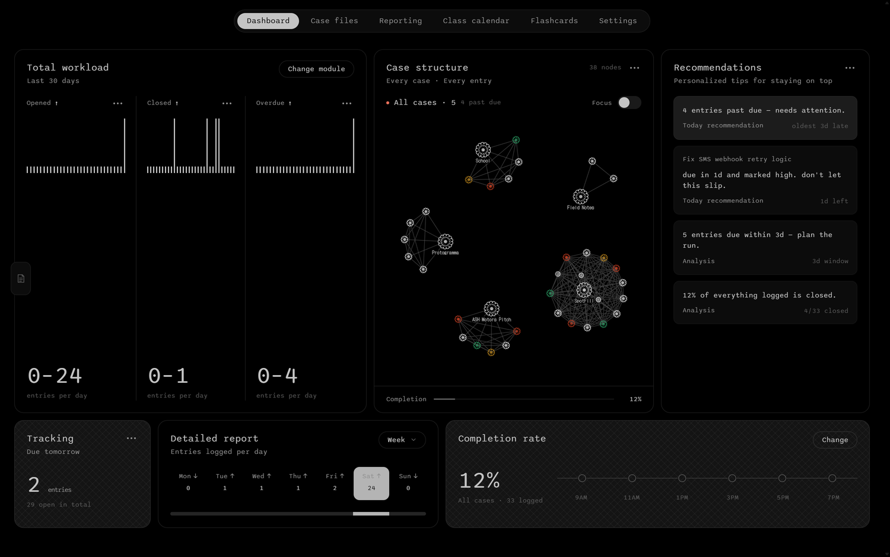
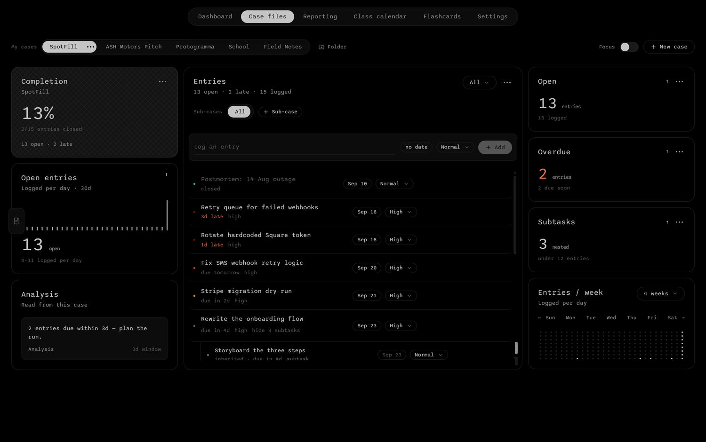
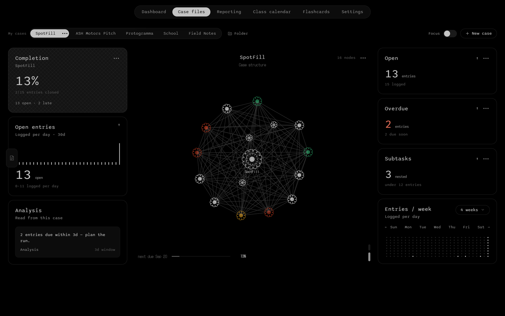
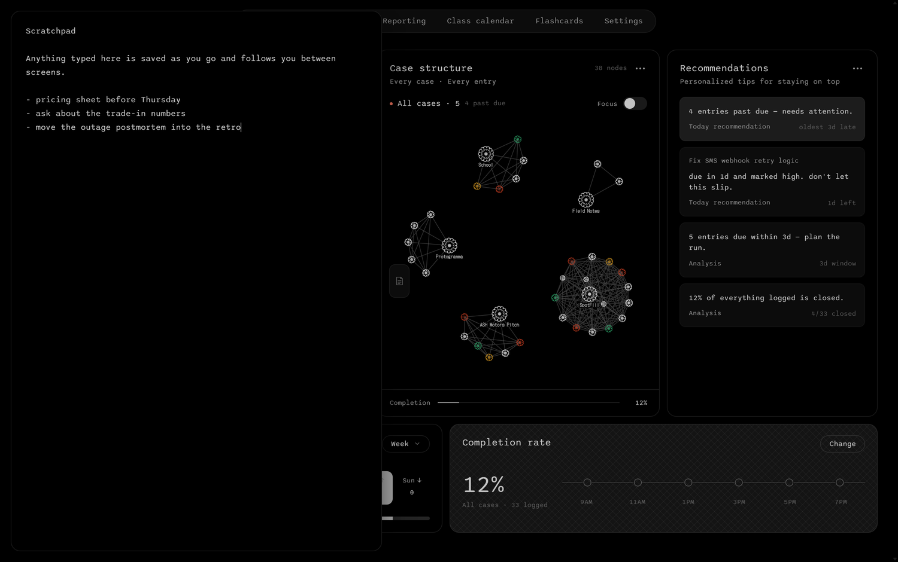
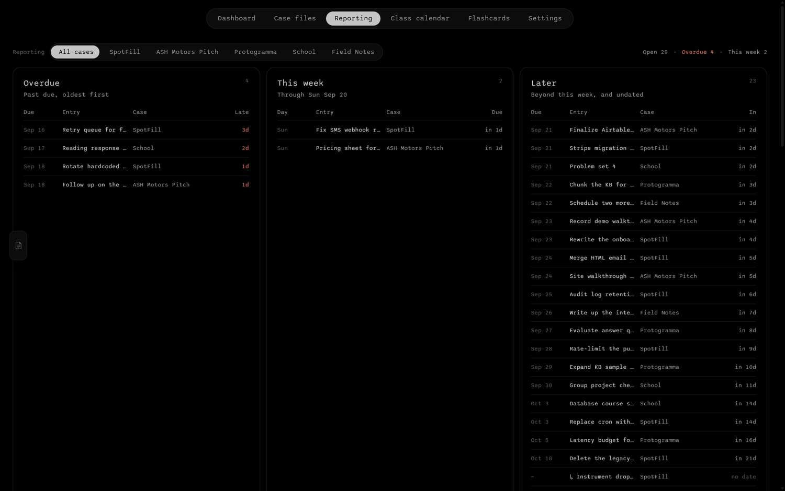
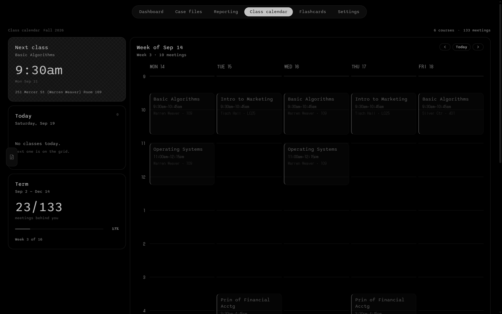

# Case

A local-first case tracker. Work is grouped into **cases**, each holding **entries** with
due dates, priorities and nested subtasks; the app reads that back to you as a dashboard
rather than a to-do list — completion rates, what is overdue, what is stalled, and a
weekly class timetable read straight from a registrar `.ics` export.

Everything runs on your own machine against a local SQLite file. There is no account, no
sync and no telemetry.



---

## Screens

| | |
|---|---|
| **Dashboard** | Completion, open and overdue counts, entries per week, and the case-structure diagram for whichever case is selected. |
| **Case files** | The working screen. Create, rename, reorder and delete cases; add sub-cases; log entries with dates and priorities; nest subtasks under an entry. |
| **Reporting** | Every open entry bucketed by due day — Overdue / This week / Later — plus a world-news feed from public RSS. |
| **Class calendar** | A weekly timetable parsed from `src/data/class-calendar.ics`, with next class, today's agenda and term progress. |
| **Flashcards** | Import a deck from a `.json` file or pasted text, file it under a course, and review it on an SM-2 spaced schedule. No model is ever called — the decks are written elsewhere and only read here. |
| **Settings** | Motion preferences, including a reduced-motion override. |

A scratchpad sits behind a tab on the left edge of every screen: a page slides out with
nothing on it but somewhere to type. It saves as you go and follows you between screens.



Entries come first on the Case files screen, with the diagram behind them — the two dots
at the corner switch between them. **Dragging one entry onto another files it as a
subtask**, and dragging it onto an entry in a different case moves it there. Subtasks stay
one level deep, so an entry that already holds subtasks cannot itself become one.

### The case-structure diagram



A force-directed graph, and the centrepiece of the Dashboard and Case files screens. Every
case, sub-case, entry and subtask is a node; inside a case, every node is joined to every
other. No edge ever crosses a case — that is a property of how the graph is built rather
than a rule applied afterwards — so the dashboard's *All cases* view separates into one
cluster per case on its own.

Nodes are guilloche rosettes, drawn as epitrochoids: a ring of closed loops, with a second
band inside it on a case or a sub-case so a hub is findable without spending a colour on
it. Colour is reserved for state — **white** open, **amber** due soon, **red** overdue,
**green** closed — and hovering a node lights its whole case and opens a readout.

Two things about it are worth knowing, because both were measured rather than assumed:

- **The layout zooms as a whole**, one transform on one group, so a node's size and its
  distance from its neighbours scale together. The proportion between them is what gives
  the drawing its character, and this is what stops it drifting with how many cases happen
  to be on screen. It also makes overlap scale-invariant, so separation is a fact about
  the layout rather than something recomputed against the current zoom.
- **The shape you get is the shape of your data.** A case whose entries all hang directly
  off it is a star, every entry interchangeable, and a force simulation answers a
  symmetric question symmetrically — you get a ring. Lobes and sub-clusters come from
  depth: sub-cases grouping entries, or entries with subtasks of their own.

### The scratchpad



### Reporting



### Class calendar



---

## Running it

Requires **Node 24 or newer** — the server uses the built-in `node:sqlite` module and
`--env-file`, both of which are unavailable on older releases.

```bash
npm install
cp .env.example .env      # required: node --env-file fails if the file is absent
npm run app               # build the frontend, then serve everything on :4001
```

Optionally drop your own timetable in as `src/data/class-calendar.local.ics` — see
[Swapping in your own class schedule](#swapping-in-your-own-class-schedule).

Then open <http://localhost:4001>.

The database is created and seeded with sample cases on first run at
`server/case-file.sqlite`. That file is deliberately **not** tracked by git — it holds
real content, not fixtures.

### Other scripts

| command | what it does |
|---|---|
| `npm run dev` | Vite dev server with hot reload, plus the API on `:4001` |
| `npm run server` | API only, restarting on change |
| `npm run build` | Production build into `dist/` |
| `npm start` | Serve an existing build |

`.env` needs no secrets. Only `PORT` is read, and it defaults to `4001`.

---

## Swapping in your own class schedule

The Class calendar screen has nothing hard-coded. It parses a registrar `.ics` export, so
a new term is a file swap:

1. Download the `.ics` from your student portal.
2. Save it as **`src/data/class-calendar.local.ics`**.
3. Rebuild.

Courses, rooms, meeting times, holidays and the term's length all follow from the file.

The repo ships a fictional `src/data/class-calendar.ics` so a fresh clone builds and the
screen has something to draw — it is labelled *sample data* in the header. Your own
schedule goes in the `.local.ics` name, which is gitignored and takes precedence whenever
it exists. A real timetable is personal (course names, buildings, room numbers), and it
should not end up in anyone's git history, including yours.

Two things worth knowing about the parser (`src/lib/ics.js`):

- **Times are read as wall-clock, not converted.** A 09:30 class reads 09:30 wherever you
  open the app. That is the right answer for the person walking to it, and the only honest
  option without shipping a timezone database — but open it from another timezone and the
  times are still campus times, not yours.
- It handles weekly `RRULE`s with `BYDAY`/`UNTIL` and subtracts `EXDATE` holidays, which is
  the whole of what a class schedule uses. Anything it does not understand is skipped
  rather than guessed at, so an unfamiliar export loses events instead of inventing them.

---

## Layout

```
server/
  index.js      Express API + static hosting for the built frontend
  db.js         schema, migrations and first-run seed
  news.js       RSS fetch and place-name resolution for Reporting
src/
  views/        one file per screen
  ui/           primitives, charts, the case graph, the scratchpad drawer
  lib/          API client, metrics, the graph builder, SM-2, .ics parsing
  data/         the sample class-calendar .ics
  styles.css    the design system — every colour is a token here
  motion.css    the assembly and transition choreography
```

### Stack

React 19 and Vite on the front, Express on the back, SQLite through Node's built-in
`node:sqlite`. No ORM, no state library, no CSS framework. Icons are `lucide-react`;
`compromise` and `fast-xml-parser` serve the news feed.

---

## Notes on the design

Two conventions are load-bearing, and breaking either one shows immediately:

- **`src/styles.css` is the only place a colour is written down.** Components reference
  tokens; they never contain a hex value. The graph follows this too: each node group sets
  one custom property and its dot, its rosette and its label all read from that, so they
  cannot disagree about what state the entry is in.
- **Animations must fail safe.** Every hidden-start animation is gated behind a class that
  is removed once the sequence is spent, so an animation that cannot run leaves content
  visible rather than stranded at `opacity: 0`.

`prefers-reduced-motion` is honoured throughout, and can be forced on from Settings. The
graph honours it by running its simulation to convergence in one synchronous pass and
painting the settled result — a reduced-motion reader gets the same graph, not an empty
box.
